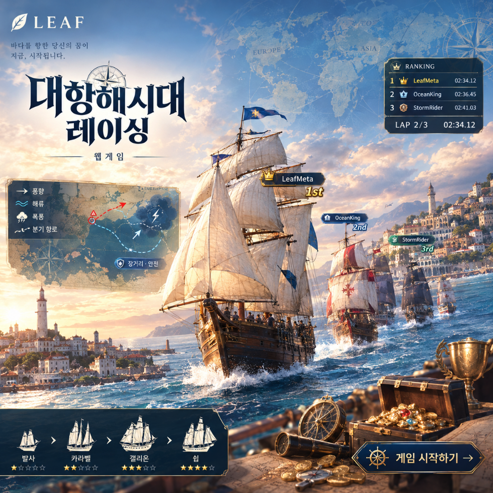

# 대항해시대 레이싱

바다를 향한 당신의 꿈이 지금, 시작됩니다.

<p align="center"></p>

## ▶ 바로 플레이

**https://leaf-kit.github.io/game-ocean-racing/**

설치 없이 브라우저에서 바로 실행됩니다. (Chrome 권장, WebGL 필요)

브라우저에서 바로 즐기는 3D 범선 레이싱 웹 게임입니다. 함선 20종 중 하나를 골라 리스본에서 출항해 세계를 세 바퀴 돌며, 기항지마다 대항해시대의 역사와 인물을 만납니다.

## 스토리

1497년, 리스본의 새벽 항구. 국왕은 세계를 한 바퀴 돌아 가장 먼저 돌아오는 제독에게 **신대륙의 총독 자리**를 약속했다. 항구에는 스무 척의 배가 닻을 올리고 있다. 가벼운 발사부터 철갑을 두른 거북선까지, 저마다 다른 바람을 품은 배들이다.

당신은 그 가운데 한 척의 제독이다. 카나리아의 무역풍을 타고 남쪽으로, 디아스가 "폭풍의 곶"이라 부른 희망봉을 돌아 인도양으로. 캘리컷의 후추 냄새와 말라카의 향신료 시장을 지나 나가사키에 닿으면, 이제 세상에서 가장 넓은 바다가 기다린다. 마닐라 갤리온만이 알던 태평양의 귀환 항로를 찾아 아카풀코에 상륙하고, 카리브해의 보물 항구 카르타헤나와 아바나를 거쳐, 아조레스의 편서풍을 타고 리스본으로 돌아온다. **이것을 세 번.**

바다는 만만치 않다. 수평선에 먹구름이 몰려오면 파도가 배를 집어삼키고, 밤이 오면 은하수 아래 돛대 끝에 세인트 엘모의 불이 맺힌다. 항로 위 두루마리에는 콜럼버스와 이순신, 정화와 바르바로사의 이야기가 적혀 있고, 발견 구슬을 깨면 오로라가 하늘을 덮거나 쿠로시오 해류가 배를 밀어준다. 소용돌이는 배를 한 바퀴 돌리고, 마지막 구간에서는 크라켄이 촉수를 든다.

라이벌 다섯 척이 늘 뒤에, 때로는 앞에 있다. 앞 배의 바람 그늘에 숨어 슬립스트림으로 따라붙고, 포문을 열어 선두를 흔들고, 나무 점프대에서 하늘로 날아올라 단숨에 추월하라. 노꾼들이 SHIFT 연타에 맞춰 노를 저으면 배는 파도를 가르며 튀어나간다.

세 바퀴가 끝나고 리스본의 종이 울릴 때, 가장 먼저 닻을 내리는 이름이 역사에 남는다. **바다를 향한 당신의 꿈이 지금, 시작된다.**

## 로컬 실행

```bash
./start_server.sh
```

브라우저에서 `http://localhost:8000` 을 엽니다. (WebGL 필요)

## 조작

| 키 | 동작 |
|---|---|
| W / S | 전진 / 감속 |
| A / D | 조타 |
| SHIFT | 연타하면 급가속, 꾹 누르면 전속 항해 |
| SPACE | 포격 |
| C · M · ESC | 카메라 · 음악 · 함선 선택 |

화면 오른쪽 위에서 한국어 / English 를 고를 수 있습니다.
`assets/music/` 의 음악 파일들이 무작위 순서로 배경음악으로 재생됩니다.

## 맵

함선 선택 화면의 **맵** 항목에서 고르거나, 레이스 중 상단 **☰ 메뉴**에서 맵을 바꿔 바로 새로 시작할 수 있습니다. 메뉴에는 함선 선택으로 돌아가기와 메인으로 가기도 있습니다.

| 맵 | 특징 |
|---|---|
| **카리브 군도**<br><sub>Caribbean Isles</sub> | 열대 섬과 산호초가 흩어진 따뜻한 바다. 기본 항로. |
| **태평양**<br><sub>Pacific Ocean</sub> | 끝없이 넓은 대양. 긴 직선 구간과 큰 너울, 잦은 폭풍. |
| **지중해**<br><sub>Mediterranean</sub> | 섬 사이를 누비는 굽이진 항로. 잔잔한 바다, 절벽과 올리브빛 언덕. |
| **북극해**<br><sub>Arctic Ocean</sub> | 빙산 사이의 차가운 바다. 밤이면 오로라가 하늘을 덮는다. |
| **남극해**<br><sub>Southern Ocean</sub> | 빙붕과 거대한 빙산, 세계에서 가장 거친 파도가 이는 바다. |
| **한일해협**<br><sub>Korea Strait</sub> | 명량의 물살처럼 소용돌이가 도는 좁은 해협. 절벽 해안 사이를 달린다. |

맵마다 항로 모양, 섬 스타일(열대섬·환초·절벽·빙산), 물빛, 폭풍 빈도, 소용돌이 등장 시점이 다릅니다. 북극해와 남극해는 밤이 되면 오로라가 뜹니다.

## 모바일

스마트폰·태블릿에서도 플레이할 수 있습니다. 가로 화면을 권장합니다. 터치 기기에서는 화면 아래에 가상 조작 패드가 나타납니다. 왼쪽 ◀ ▶ 조타, 오른쪽 ▲ 전진 · ▼ 감속 · ⚡ 부스트(두드리면 급가속, 누르고 있으면 전속 항해) · 💣 포격. 화면을 누른 채 좌우로 끄는 조작도 함께 됩니다. 첫 터치에서 배경음악 재생 권한이 풀리며 메인 테마가 시작됩니다.

## 함선

21종 중 하나를 골라 출항합니다. AI 상대 5척은 범선·갤리선 중에서 무작위로 나옵니다(특수선은 AI가 타지 않습니다). 능력치는 100점 만점이며 카드에서 막대와 숫자로 확인할 수 있습니다.

- **속도**: 최고 속력. **가속**: 속력이 붙는 빠르기. **조타**: 선회 민첩성. **내구**: 충돌 시 감속·회전 저항.
- 바람에 영향을 받는 정도, 순풍·역풍 보정, 전속 항해 게이지 충전 속도, 포격 재장전 등은 함선마다 다른 **특성**으로 정해집니다.

### 범선 (Sailing Ships)
노 없이 바람의 힘으로만 항해하는 선박. 원양 항해와 교역에 적합하며 순풍을 타면 빠릅니다.

| 함선 | 국가 | 속도 | 가속 | 조타 | 내구 | 설명 | 특성 |
|---|---|:-:|:-:|:-:|:-:|---|---|
| **발사**<br><sub>Balsa</sub> | 포르투갈 | 40 | 90 | 90 | 20 | 초보 항해사가 처음 잡는 소형선. 가볍고 잘 돌지만 파도 한 번에 크게 휘청인다. | 깃털 선체 — 전속 항해 게이지 충전 최고, 충돌에 매우 약함 |
| **타렛테**<br><sub>Tarette</sub> | 이탈리아 | 50 | 80 | 80 | 40 | 지중해 연안 무역에 쓰인 소형 범선. 작은 항구 사이를 잽싸게 오갔다. | 연안 항해 — 항로 이탈 시 감속이 절반 |
| **다우**<br><sub>Dhow</sub> | 아라비아 | 60 | 70 | 80 | 40 | 인도양의 계절풍을 타고 아프리카와 인도를 오간 아랍 선박. 큰 삼각돛 하나로 바람을 움켜쥔다. | 계절풍의 아이 — 순풍 보너스 1.4배 |
| **카라벨 라티나**<br><sub>Caravel Latina</sub> | 포르투갈 | 60 | 80 | 90 | 40 | 삼각 돛을 단 탐험선. 디아스가 희망봉을 돌 때 탄 배가 이 형식이다. 역풍을 거슬러 오를 수 있었다. | 삼각돛 — 역풍 페널티 절반, 조타 우수 |
| **카라벨 레돈다**<br><sub>Caravel Redonda</sub> | 포르투갈 | 70 | 80 | 70 | 50 | 사각 돛을 단 카라벨 개량형. 콜럼버스의 니냐호가 항해 중 이 형식으로 개조되었다. | 바람 적응 — 전속 항해 게이지가 빠르게 충전됨 |
| **나오**<br><sub>Nao</sub> | 스페인 | 60 | 60 | 60 | 60 | 어디서나 구할 수 있는 대표적 범선. 콜럼버스의 기함 산타마리아호가 나오였다. | 만능 — 보급품 효과 1.5배 |
| **슬루프**<br><sub>Sloop</sub> | 영국 | 80 | 90 | 100 | 30 | 돛대 하나에 큰 돛을 단 최고의 탐험용 소형선. 얕은 해안과 좁은 수로를 자유자재로 누빈다. | 탐험가의 배 — 선회 최강, 순풍 보너스 1.3배 |
| **카락**<br><sub>Carrack</sub> | 포르투갈 | 70 | 50 | 50 | 80 | 원양 항해를 위해 만들어진 중형 범선. 마젤란의 빅토리아호, 다 가마의 상가브리엘호가 카락이었다. | 원양 항해 — 폭풍 파도에 밀리는 정도 절반 |
| **갤리온**<br><sub>Galleon</sub> | 스페인 | 80 | 50 | 40 | 90 | 보물을 실어 나르던 거함. 전투와 교역 모두 뛰어난 다목적 범선. 무겁지만 부딪히면 상대가 날아간다. | 철벽 선체 — 충돌 시 상대를 강하게 밀어내고 자신은 거의 감속하지 않음 |
| **쉽**<br><sub>Ship</sub> | 영국 | 100 | 30 | 30 | 100 | 최대의 적재량과 선원을 자랑하는 최강의 대형 범선. 느리게 출발하지만 한번 속도가 붙으면 멈추지 않는다. | 거함 — 최고 속도 최상급, 전속 항해가 1.5배 오래 지속 |
| **플루트**<br><sub>Fluyt</sub> | 네덜란드 | 70 | 60 | 50 | 70 | 적은 선원으로 많은 짐을 나르도록 설계된 네덜란드 무역선. 17세기 해상 무역을 제패했다. | 상인의 눈 — 금화·보급품 획득 반경 1.6배 |
| **프리깃**<br><sub>Frigate</sub> | 네덜란드 | 80 | 70 | 60 | 70 | 해상 무역을 지배한 전투 함선. 빠른 재장전으로 앞선 배를 저격하라. | 속사포 — 포격 재장전 2배 빠름, 2연발 발사 |
| **클리퍼**<br><sub>Clipper</sub> | 영국 | 100 | 60 | 60 | 30 | 바다 위의 준마. 순풍을 타면 누구도 따라올 수 없다. 단, 선체는 약하다. | 질주 — 최고 속도 최강, 순풍 보너스 1.5배, 충돌에 취약 |
| **정크선**<br><sub>Junk</sub> | 명나라 | 60 | 90 | 90 | 60 | 정화의 대함대를 이끈 동양의 명선. 대나무살 돛으로 역풍에도 흔들리지 않는 안정성. | 역풍 무시 — 맞바람 페널티 절반, 회전이 매우 민첩 |

### 갤리선 (Galleys)
노를 저어 움직여 바람이 없거나 역풍에도 기동성이 좋습니다. 가속과 선회에 강합니다.

| 함선 | 국가 | 속도 | 가속 | 조타 | 내구 | 설명 | 특성 |
|---|---|:-:|:-:|:-:|:-:|---|---|
| **경갤리**<br><sub>Light Galley</sub> | 베네치아 | 50 | 100 | 90 | 30 | 가장 기초적인 소형 갤리선. 노꾼들의 힘으로 바람이 죽은 바다에서도 튀어나간다. | 노 젓기 — 바람 영향 거의 없음, 가속 최강 |
| **갤리**<br><sub>Galley</sub> | 오스만 | 60 | 90 | 70 | 50 | 지중해의 표준 갤리선. 레판토 해전에서 양측 수백 척이 노를 저어 맞붙었다. | 노 젓기 — 바람 영향 거의 없음, 충돌 시 회전이 적음 |
| **라레아르**<br><sub>La Réale</sub> | 프랑스 | 80 | 90 | 80 | 40 | 프랑스 왕실의 기함급 고급 갤리선. 기동성과 속도를 모두 갖춘 탐험용 갤리. | 왕실 노꾼 — 바람 영향 적음, 게이지 충전 빠름, 선회 우수 |
| **베네치안 갤리어스**<br><sub>Venetian Galleass</sub> | 베네치아 | 70 | 70 | 50 | 90 | 범선과 갤리선의 장점을 합친 강력한 전투함. 레판토에서 포화로 오스만 함대를 무너뜨렸다. | 포열 — 2연발 포격, 노로 역풍 무시, 튼튼한 선체 |
| **자벡**<br><sub>Xebec</sub> | 바르바리 | 80 | 80 | 80 | 40 | 바르바리 해적이 애용한 삼각돛 쾌속선. 돛과 노를 함께 써서 상선을 덮쳤다. | 해적 — 포격 명중 시 전속 항해 게이지 +30%, 빠른 재장전 |
| **거북선** ★<br><sub>Turtle Ship</sub> | 조선 | 100 | 100 | 100 | 100 | ★ 스페셜 함선. 이순신 장군의 철갑 거북선. 모든 능력치 100 — 속도·가속·조타·내구 어느 하나 빠지지 않는 최강의 함선. | 전설의 철갑 — 바람 무시, 충돌 시 무적, 2연발 속사포, 폭풍에도 끄떡없음, 용머리 화염 부스트 |

### 특수선 (Special Craft)
역사의 경계를 넘어온 배. 규격 밖의 성능으로 항로를 지배합니다.

| 함선 | 국가 | 속도 | 가속 | 조타 | 내구 | 설명 | 특성 |
|---|---|:-:|:-:|:-:|:-:|---|---|
| **위그선** ★<br><sub>WIG Craft</sub> | 미래 | 300 | 80 | 60 | 50 | ★ 세계에서 가장 빠른 배. 날개로 수면 위 공기를 눌러 파도 위를 날아가는 수면비행선(Wing-In-Ground). 속도 300 — 돛도 노도 없이 바다를 가른다. | 지면효과 비행 — 속도 300, 파도·바람의 영향을 거의 받지 않음, 항상 수면 위를 낮게 비행 |

★ 거북선은 모든 능력치가 100인 스페셜 함선, 위그선은 속도 300의 세계에서 가장 빠른 배입니다.

## 제독

함선 선택 화면에서 제독 초상 12명 중 하나를 고르고 이름을 정합니다. 초상은 외부 이미지 없이 캔버스로 그린 인물화이며, 선택한 초상과 이름이 레이스 중 우측 상단 배지·순위표·결과 화면에 표시됩니다.

| 제독 | 출신 | 특징 |
|---|---|---|
| **이순신**<br><sub>Yi Sun-sin</sub> | 조선 | 임진왜란 23전 전승의 명장. 갓과 붉은 전포. 거북선과 학익진의 주인공으로, 게임의 스페셜 함선 거북선과 짝을 이룬다. |
| **콜럼버스**<br><sub>Columbus</sub> | 제노바 | 지구가 생각보다 작다고 믿고 서쪽으로 향한 항해가. 베레모와 보라색 외투. 아메리카에 닿고도 끝까지 인도라 여겼다. |
| **마젤란**<br><sub>Magellan</sub> | 포르투갈 | 세계 일주 원정을 이끈 지휘관. 검은 외투와 짙은 수염. 태평양에 이름을 붙였으나 막탄에서 전사했다. |
| **바스코 다 가마**<br><sub>Vasco da Gama</sub> | 포르투갈 | 희망봉을 돌아 인도 항로를 연 제독. 진홍 외투와 베레모. 4만 km의 대항해를 완수했다. |
| **드레이크**<br><sub>Francis Drake</sub> | 잉글랜드 | 여왕의 사략선장. 짙은 남색 코트와 흰 러프 깃. 스페인 보물선을 털며 세계를 돌고 무적함대를 꺾었다. |
| **정화**<br><sub>Zheng He</sub> | 명나라 | 일곱 차례 대함대를 이끈 환관 제독. 관모와 붉은 관복. 아프리카 동해안까지 항해했다. |
| **바르바로사**<br><sub>Hayreddin Barbarossa</sub> | 오스만 | 붉은 수염의 대제독. 흰 터번과 초록 카프탄. 갤리 함대로 지중해를 지배한 바르바리 해적 출신. |
| **엘카노**<br><sub>Elcano</sub> | 스페인 | 마젤란 사후 빅토리아호를 이끌고 최초의 세계 일주를 완성. 삼각모와 갈색 코트. |
| **디아스**<br><sub>Bartolomeu Dias</sub> | 포르투갈 | 1488년 희망봉을 처음 돈 탐험가. 남빛 외투. 훗날 바로 그 곶 앞바다의 폭풍에 사라졌다. |
| **엔히크 왕자**<br><sub>Prince Henry</sub> | 포르투갈 | 항해왕자. 검은 샤프롱과 금빛 목걸이. 직접 바다에 나가지 않고도 대항해시대의 문을 열었다. |
| **카탈리나 데 에라우소**<br><sub>Catalina de Erauso</sub> | 스페인 | 수녀원을 탈출해 남장 군인으로 신대륙을 누빈 실존 인물. 깃털 모자와 자주색 코트. |
| **피리 레이스**<br><sub>Piri Reis</sub> | 오스만 | 제독이자 지도 제작자. 흰 터번과 푸른 카프탄. 1513년 지도에 남아메리카 해안을 놀랍도록 정확히 그렸다. |

## 역사

항해하는 동안 실제 대항해시대의 역사를 만납니다. 우측 상단 세계지도와 함께 기항지 해설이, 우측 연대기 카드에 연월일 순의 사건이 흐르고, 항로 위 📜 두루마리와 🔮 발견 구슬을 밟으면 인물과 현상·사물·사건을 배웁니다. 결과 화면에 이번 항해에서 배운 목록이 정리됩니다.

### 기항지 14곳 (세계 일주 항로 순)

| # | 기항지 | 연도 | 지역 | 해설 |
|:-:|---|:-:|---|---|
| 1 | **리스본** | 1497 | 포르투갈 | 바스코 다 가마가 이곳에서 출항해 인도 항로를 열었다. 엔히크 항해왕자가 후원한 항해 연구가 대항해시대의 문을 열었다. |
| 2 | **카나리아 제도** | 1492 | 스페인령 | 콜럼버스가 대서양 횡단 전 마지막으로 물과 식량을 채운 곳. 북동 무역풍을 타고 서쪽으로 향했다. |
| 3 | **카보베르데** | 1494 | 포르투갈령 | 토르데시야스 조약은 이 섬 서쪽 370레구아에 선을 그어 스페인과 포르투갈이 세계를 나눠 갖게 했다. |
| 4 | **엘미나** | 1482 | 황금 해안 | 포르투갈이 사하라 이남에 세운 최초의 유럽 요새 상조르즈 다 미나. 황금 무역의 거점이었으나 뒤에는 노예 무역의 비극이 이어졌다. |
| 5 | **희망봉** | 1488 | 아프리카 남단 | 바르톨로메우 디아스가 처음 돌았을 때는 "폭풍의 곶"이라 불렀다. 주앙 2세가 인도로 가는 희망을 담아 "희망봉"으로 고쳐 불렀다. |
| 6 | **모잠비크** | 1498 | 스와힐리 해안 | 다 가마 함대가 정박해 스와힐리 무역 도시와 처음 접촉했다. 이후 말린디에서 얻은 아랍 항해사의 안내로 인도양을 건넜다. |
| 7 | **캘리컷** | 1498 | 인도 말라바르 | 1498년 5월 다 가마가 도착해 유럽과 인도를 잇는 해상 항로가 완성됐다. 후추와 향신료 무역의 심장부였다. |
| 8 | **말라카** | 1511 | 말레이 반도 | 향신료 항로의 관문. 정화의 대함대가 기지로 삼았고, 1511년 알부케르크가 점령해 포르투갈의 동방 거점이 됐다. |
| 9 | **나가사키** | 1571 | 일본 | 포르투갈 무역선에 개항하며 남만 무역이 시작됐다. 조총, 카스텔라, 기독교가 이 항구를 통해 일본에 전해졌다. |
| 10 | **마닐라** | 1571 | 필리핀 | 스페인이 세운 아시아 거점. 마닐라 갤리온이 250년간 멕시코의 은과 중국의 비단·도자기를 실어 날랐다. |
| 11 | **아카풀코** | 1565 | 누에바에스파냐 | 우르다네타가 쿠로시오 해류와 편서풍을 이용한 태평양 동향 항로를 찾아내 마닐라 갤리온 무역이 시작됐다. |
| 12 | **카르타헤나** | 1533 | 카리브해 | 신대륙의 은이 모이던 스페인 보물선단의 요새 항구. 드레이크 같은 사략선의 표적이 되어 거대한 성벽을 쌓았다. |
| 13 | **아바나** | 1519 | 쿠바 | 보물선단이 대서양 횡단 전 집결하던 항구. 멕시코 만류를 타고 북상한 뒤 편서풍으로 유럽에 돌아갔다. |
| 14 | **아조레스** | 1427 | 대서양 한가운데 | 귀항하는 인도 함대와 보물선단의 중계지. 바람을 크게 돌아 귀환하는 "볼타 두 마르" 항법의 핵심이었다. |

### 연대기 32건 (1415 → 1761)

| 날짜 | 사건 | 내용 |
|---|---|---|
| 1415.08.21 | **세우타 점령** | 포르투갈이 북아프리카 세우타를 점령하며 대항해시대의 서막이 오른다. |
| 1419 | **사그레스의 항해 연구** | 엔히크 항해왕자가 지도 제작자·조선공·천문학자를 모아 탐험을 후원하기 시작한다. |
| 1434 | **보자도르 곶 돌파** | 질 이아네스가 "돌아올 수 없는 곶"이라 불리던 보자도르 곶을 넘어 공포를 깼다. |
| 1456 | **카보베르데 제도 발견** | 베네치아 출신 카다모스토가 포르투갈 왕실을 위해 카보베르데 제도를 발견한다. |
| 1488.02.03 | **희망봉 도달** | 바르톨로메우 디아스가 아프리카 남단을 돌아 모셀만에 상륙. 인도양이 열렸다. |
| 1492.08.03 | **콜럼버스 출항** | 산타마리아·핀타·니냐 3척이 스페인 팔로스 항을 떠나 서쪽으로 향한다. |
| 1492.10.12 | **신대륙 상륙** | 콜럼버스가 바하마의 과나하니(산살바도르)에 상륙한다. 그는 그곳을 인도라 믿었다. |
| 1494.06.07 | **토르데시야스 조약** | 스페인과 포르투갈이 카보베르데 서쪽 370레구아 선을 기준으로 세계를 둘로 나눈다. |
| 1497.07.08 | **다 가마 출항** | 바스코 다 가마가 4척을 이끌고 리스본을 떠나 인도를 향한다. |
| 1498.05.20 | **캘리컷 도착** | 다 가마가 인도 캘리컷에 닿아 유럽-인도 해상 항로가 완성된다. |
| 1500.04.22 | **브라질 발견** | 카브랄이 인도로 가던 중 서쪽으로 크게 돌다 브라질 해안에 닿는다. |
| 1507.04.25 | **"아메리카"라는 이름** | 발트제뮐러의 세계지도가 신대륙에 아메리고 베스푸치의 이름을 붙인다. |
| 1510.11.25 | **고아 점령** | 알부케르크가 인도 고아를 점령해 포르투갈 동방 제국의 수도로 삼는다. |
| 1511.08.24 | **말라카 점령** | 알부케르크가 향신료 항로의 관문 말라카를 손에 넣는다. |
| 1513.09.25 | **태평양 발견** | 발보아가 파나마 지협을 넘어 유럽인 최초로 태평양을 본다. |
| 1519.09.20 | **마젤란 출항** | 5척 약 270명이 스페인 산루카르를 떠나 서쪽 향신료 항로를 찾아 나선다. |
| 1520.11.28 | **마젤란 해협 통과** | 남아메리카 끝의 해협을 빠져나온 바다가 잔잔해 "태평양(Mar Pacífico)"이라 이름 짓는다. |
| 1521.04.27 | **마젤란 전사** | 필리핀 막탄섬에서 라푸라푸의 전사들과 싸우다 마젤란이 목숨을 잃는다. |
| 1522.09.06 | **최초의 세계 일주** | 엘카노가 이끄는 빅토리아호가 18명만 태운 채 스페인으로 돌아온다. |
| 1543.08.25 | **조총 전래** | 포르투갈인이 탄 배가 일본 다네가시마에 표착해 조총을 전한다. |
| 1565.06.01 | **태평양 귀환 항로** | 우르다네타가 쿠로시오와 편서풍을 타고 필리핀에서 멕시코로 돌아가는 길을 찾는다. |
| 1571.10.07 | **레판토 해전** | 신성동맹 갤리 함대가 오스만 함대를 격파. 갤리선 시대 최후의 대해전. |
| 1577.12.13 | **드레이크 출항** | 드레이크가 골든하인드호로 세계 일주 겸 스페인 보물선 사냥에 나선다. |
| 1588.08.08 | **무적함대 패배** | 그라블린 해전에서 영국이 스페인 아르마다를 물리친다. |
| 1592.07.08 | **한산도 대첩** | 이순신이 학익진으로 일본 수군을 대파. 거북선이 선봉에 섰다. |
| 1597.09.16 | **명량 해전** | 이순신이 13척으로 130여 척의 일본 함대를 울돌목에서 막아낸다. |
| 1600.12.31 | **영국 동인도회사 설립** | 엘리자베스 1세가 동인도 무역 독점권을 부여한다. |
| 1602.03.20 | **네덜란드 동인도회사(VOC)** | 세계 최초의 주식회사가 세워져 향신료 무역을 장악한다. |
| 1606.02.26 | **오스트레일리아 상륙** | 얀스존의 다위프컨호가 유럽인 최초로 오스트레일리아 해안에 닿는다. |
| 1620.11.21 | **메이플라워호 도착** | 필그림들이 66일 항해 끝에 케이프코드에 닻을 내린다. |
| 1642.12.13 | **뉴질랜드 발견** | 아벨 타스만이 태즈메이니아에 이어 뉴질랜드를 발견한다. |
| 1761.11.18 | **크로노미터 시험 항해** | 해리슨의 H4 시계가 자메이카까지 경도를 오차 몇 km로 맞춘다. 경도 문제가 풀렸다. |

### 역사 인물 18명 (📜 두루마리)

| 인물 | 생몰 | 소개 |
|---|---|---|
| **엔히크 항해왕자** | 1394~1460 | 포르투갈 왕자. 직접 항해하지 않았지만 아프리카 서해안 탐험을 40년간 후원해 대항해시대를 열었다. |
| **바르톨로메우 디아스** | 1450?~1500 | 1488년 희망봉을 처음 돌았다. 훗날 카브랄 함대에 합류했다가 바로 그 희망봉 앞바다 폭풍에서 실종됐다. |
| **크리스토퍼 콜럼버스** | 1451~1506 | 제노바 출신. 지구 둘레를 실제보다 작게 계산해 서쪽으로 인도에 갈 수 있다고 믿었고, 대신 아메리카에 닿았다. |
| **바스코 다 가마** | 1460?~1524 | 1498년 인도 항로를 열었다. 항해 거리는 콜럼버스 1차 항해의 4배가 넘는 약 4만 km였다. |
| **아메리고 베스푸치** | 1454~1512 | 신대륙이 아시아가 아닌 별개의 대륙임을 주장했다. 그 이름이 "아메리카"가 되었다. |
| **페르디난드 마젤란** | 1480~1521 | 포르투갈인이지만 스페인 왕의 후원으로 세계 일주 항해를 이끌었다. 필리핀에서 전사해 일주를 완성하지는 못했다. |
| **후안 세바스티안 엘카노** | 1476~1526 | 마젤란 사후 빅토리아호를 지휘해 1522년 최초의 세계 일주를 완성했다. 문장에 "네가 나를 처음 일주했다"는 글귀를 받았다. |
| **정화(鄭和)** | 1371~1433 | 명나라 환관 제독. 1405~1433년 일곱 차례 대함대를 이끌고 동남아·인도·아라비아·동아프리카까지 항해했다. |
| **이순신** | 1545~1598 | 조선 수군 장군. 임진왜란 23전 전승. 거북선과 학익진으로 일본 수군을 막아냈다. |
| **프랜시스 드레이크** | 1540?~1596 | 영국의 사략선장. 스페인 보물선을 털며 세계를 일주했고, 무적함대 격파에 공을 세웠다. |
| **아폰수 드 알부케르크** | 1453~1515 | 고아·말라카·호르무즈를 점령해 포르투갈의 인도양 제국을 세운 "동방의 사자". |
| **하이레딘 바르바로사** | 1478?~1546 | 오스만 제국의 대제독. 지중해를 갤리 함대로 지배한 바르바리 해적 출신. |
| **피리 레이스** | 1465?~1553 | 오스만 제독이자 지도 제작자. 1513년 지도에 남아메리카 해안이 놀랍도록 정확히 그려져 있다. |
| **게라르두스 메르카토르** | 1512~1594 | 1569년 항해용 도법을 발표했다. 나침반 방위를 직선으로 그릴 수 있는 이 지도는 지금도 쓰인다. |
| **안드레스 데 우르다네타** | 1498~1568 | 수도사이자 항해사. 태평양을 동쪽으로 건너는 귀환 항로를 찾아 마닐라 갤리온 무역을 가능하게 했다. |
| **페드루 알바르스 카브랄** | 1467?~1520 | 인도로 가던 길에 브라질을 발견했다. 함대에는 희망봉의 디아스도 타고 있었다. |
| **바스코 누녜스 데 발보아** | 1475~1519 | 파나마 지협을 걸어 넘어 유럽인 최초로 태평양을 본 탐험가. |
| **존 해리슨** | 1693~1776 | 시계 장인. 흔들리는 배에서도 정확한 크로노미터를 만들어 바다 위 경도 측정을 가능하게 했다. |

### 발견 18가지 (🔮 발견 구슬)

| 분류 | 이름 | 게임 효과 | 설명 |
|---|---|---|---|
| 자연현상 | **오로라** | 하늘에 오로라 (25초) | 고위도 밤하늘의 빛의 장막. 태양풍의 입자가 대기와 부딪혀 빛난다. 북방 항로의 선원들이 신의 징조로 여겼다. |
| 자연현상 | **세인트 엘모의 불** | 돛대 끝 푸른 불꽃 | 폭풍 전후 돛대 끝에 푸른 불꽃이 맺히는 현상. 대기 전기의 코로나 방전이다. 마젤란 함대는 이를 수호성인의 가호로 믿었다. |
| 자연현상 | **무역풍** | 12초 순풍 | 적도 양쪽에서 늘 같은 방향으로 부는 바람. 콜럼버스는 이 바람을 타고 서쪽으로 갔다. 영어 trade는 "일정한 길"이란 옛 뜻이다. |
| 자연현상 | **쿠로시오 해류** | 10초 해류 가속 | 필리핀에서 일본을 지나 북태평양을 도는 검푸른 난류. 우르다네타는 이 흐름을 타고 멕시코로 돌아갔다. |
| 자연현상 | **편서풍** | 12초 순풍 | 중위도에서 서쪽에서 동쪽으로 부는 바람. 유럽으로 돌아오는 배들은 북쪽으로 올라가 이 바람을 탔다. |
| 자연현상 | **적도 무풍대** | 15초 점수 2배 | 적도 부근에서 바람이 죽는 지대. 몇 주씩 갇힌 배에서는 물과 식량이 떨어졌다. 영어로 doldrums, "우울"이란 뜻이 됐다. |
| 자연현상 | **사르가소 해** | 15초 점수 2배 | 대서양 한가운데 해초가 떠다니는 바다. 콜럼버스 선원들은 육지가 가까운 줄 알았으나 수천 km의 바다였다. |
| 사물 | **아스트롤라베** | 15초 점수 2배 | 태양이나 별의 고도를 재서 위도를 구하는 도구. 흔들리는 갑판 위에서는 오차가 컸다. |
| 사물 | **나침반** | 15초 점수 2배 | 중국에서 발명되어 아랍을 거쳐 유럽에 전해졌다. 흐린 날에도 방위를 알 수 있게 되자 겨울 항해가 가능해졌다. |
| 사물 | **포르톨라노 해도** | 15초 점수 2배 | 항구 사이를 잇는 방위선이 그물처럼 그려진 중세 해도. 지중해 항해의 필수품이었다. |
| 사물 | **감귤 상자** | 전속 항해 게이지 충전 | 괴혈병은 비타민C 부족으로 잇몸이 무너지는 병. 1747년 린드가 감귤로 낫는다는 것을 실험으로 증명했다. |
| 사물 | **후추 자루** | 15초 점수 2배 | 한때 같은 무게의 은과 맞바꿀 만큼 비쌌다. 인도 항로는 곧 후추 항로였다. |
| 사물 | **포토시 은** | 15초 점수 2배 | 볼리비아 포토시 은광의 은이 마닐라 갤리온을 타고 중국까지 흘러 세계 화폐가 되었다. |
| 사물 | **명나라 청화백자** | 15초 점수 2배 | 유럽 왕실이 열광한 중국 도자기. 갤리온과 카락의 선창에 짚에 싸여 실려 왔다. |
| 사물 | **건빵과 소금절임** | 전속 항해 게이지 충전 | 항해 식량은 벌레 먹은 건빵과 소금에 절인 고기였다. 신선한 물은 며칠 만에 상했다. |
| 사건 | **적도 통과 의식** | 15초 점수 2배 | 처음 적도를 넘는 선원을 바닷물에 빠뜨리는 전통. "넵튠 왕"이 심판을 맡았다. |
| 사건 | **괴혈병 창궐** | 전속 항해 게이지 충전 | 다 가마의 첫 항해에서 선원 170명 중 100명 이상이 괴혈병으로 죽었다. |
| 사건 | **선상 반란** | 15초 점수 2배 | 마젤란은 파타고니아에서 반란을 진압했다. 규율은 목숨과 직결된 문제였다. |

## 라이선스

MIT
